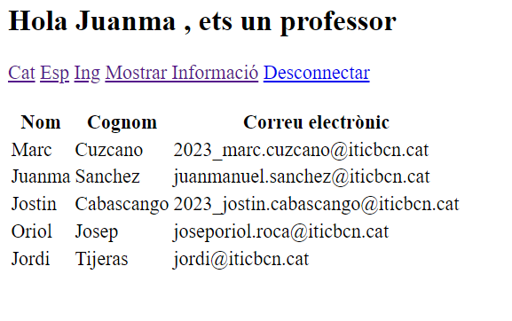
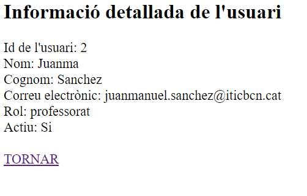
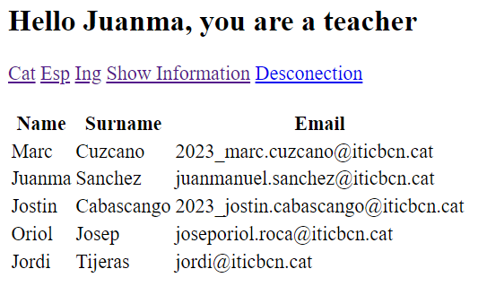
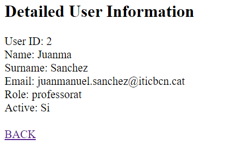

# ACTIVIDAD 7 - LOGIN & COOKIES

## Requisitos

- Servidor web con PHP y MySQL.
- Acceso a phpMyAdmin para la gestión de la base de datos.

## Objetivos de la actividad

* resolver problemas
* Aprender Git y Github
* Aprender a utilizar Cookies en PHP

## El usuario tiene rol de profesor (Catalan):

## Mostrar informacion detallada de un profesor (Catalan) :

## El usuario tiene rol de profesor (Ingles):

## Mostrar informacion detallada de un profesor (Ingles) :

